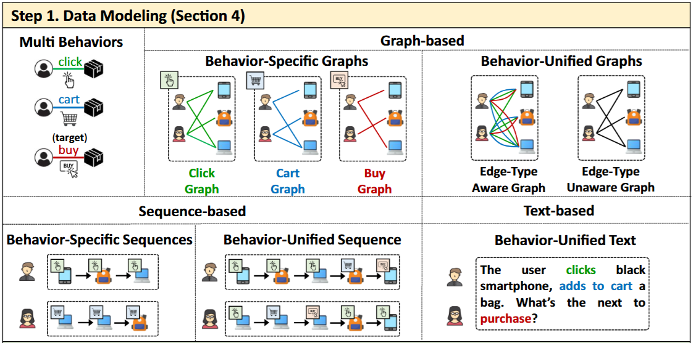
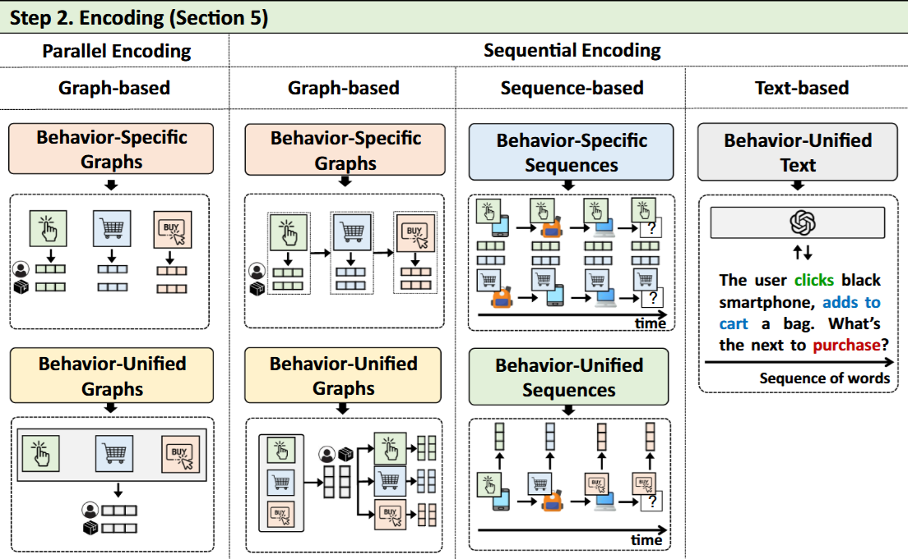
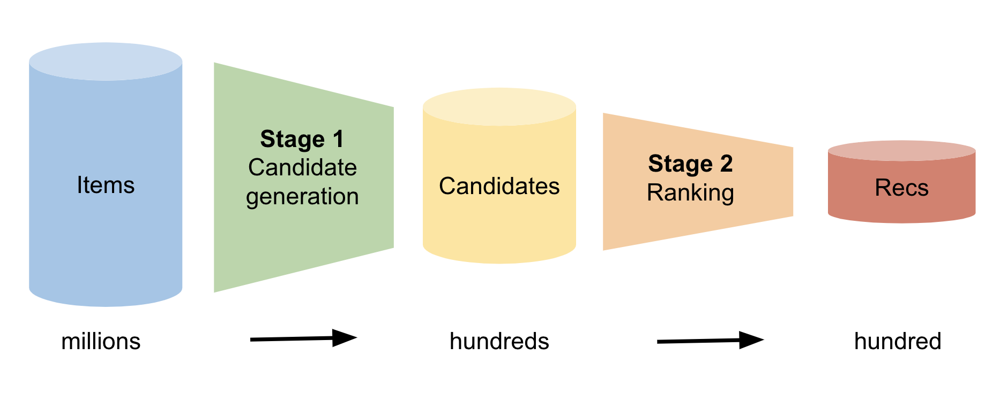
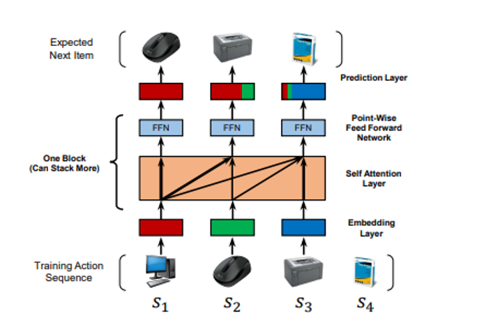
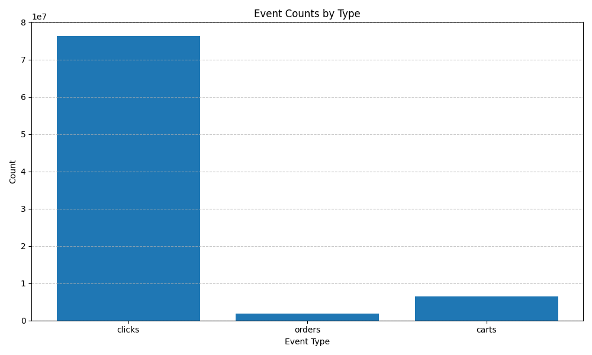
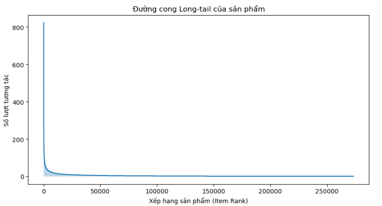
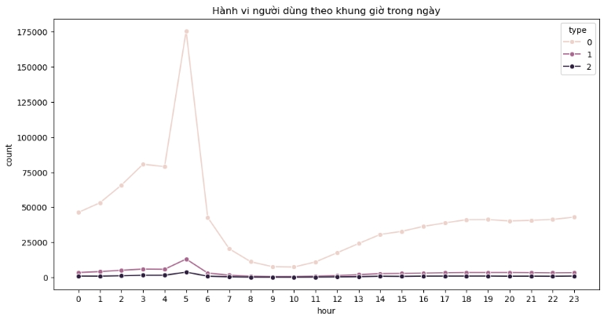
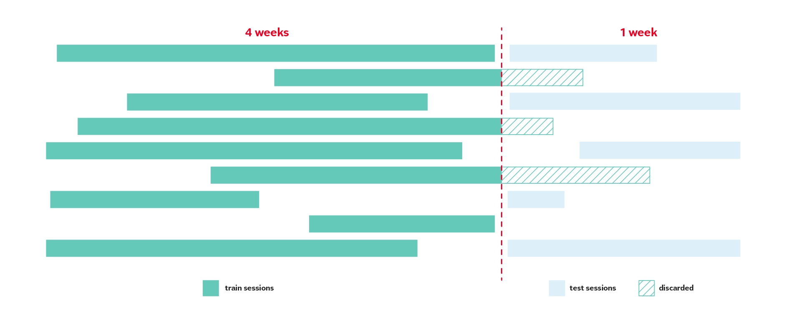
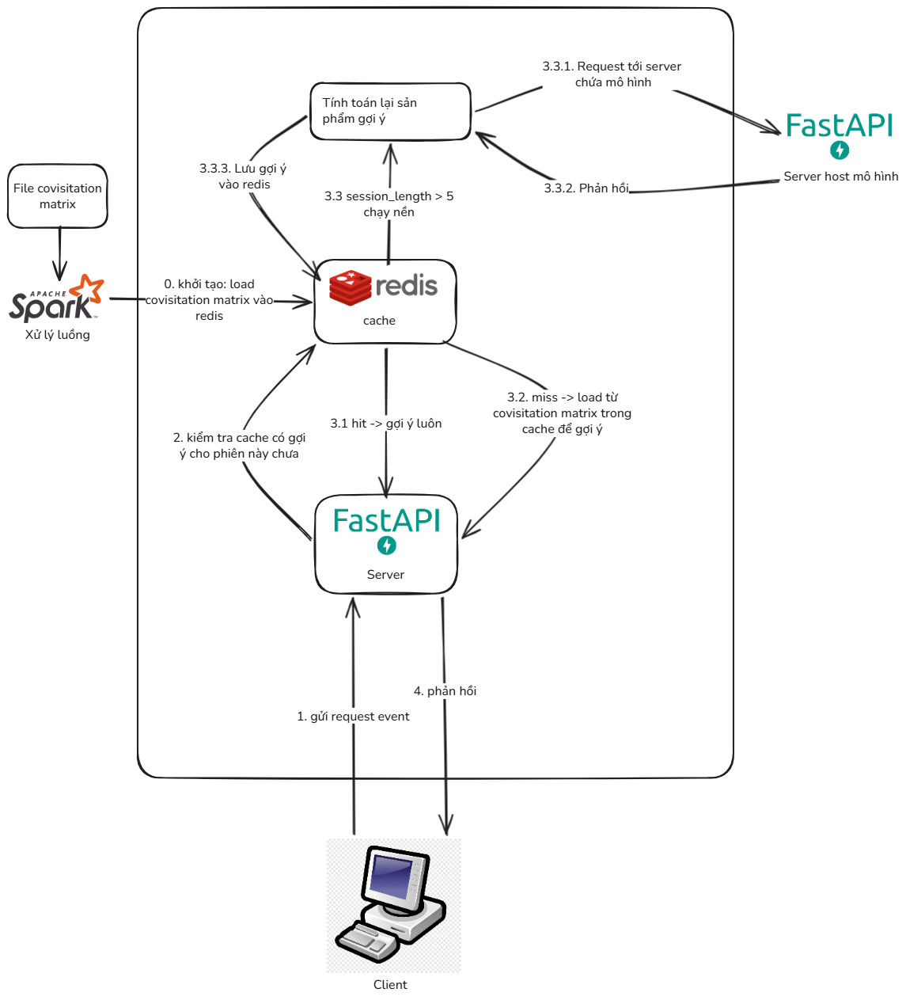
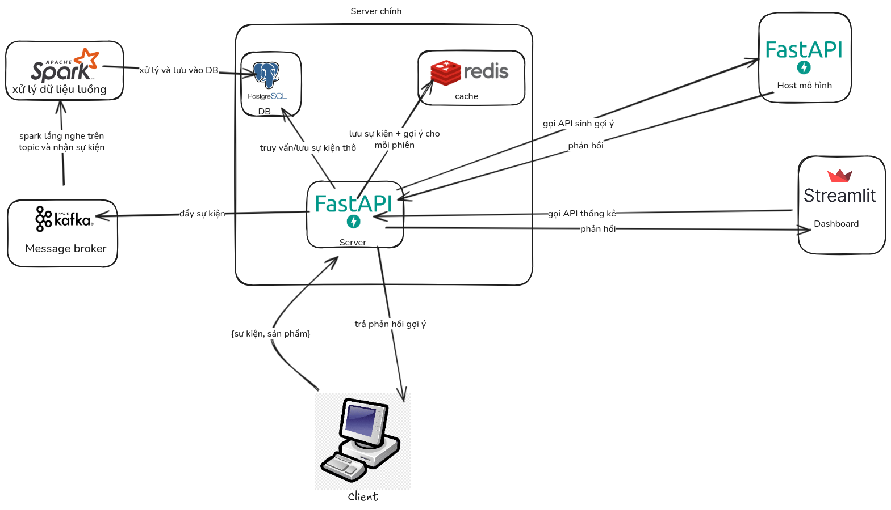

# OTTO Multi-Objective Recommender System

Hệ thống gợi ý đa mục tiêu cho dữ liệu lớn. Dự đoán hành vi người dùng trong thương mại điện tử (click, cart, order) dựa trên lịch sử phiên truy cập.

**Học phần**: PTIT - INT14155 - Khai phá dữ liệu lớn
**Dữ liệu**: OTTO Dataset from Kaggle (https://www.kaggle.com/competitions/otto-recommender-system)

---

## Tổng Quan

Đề tài giải quyết bài toán **Multi-Behavior Sequential Recommendation (MBSR)** - dự đoán đồng thời ba loại hành vi người dùng trong thương mại điện tử:
- **Click**: Xem sản phẩm
- **Cart**: Thêm vào giỏ hàng
- **Order**: Đặt hàng

Khác với các hệ gợi ý truyền thống chỉ xét một loại hành vi, MBSR khai thác cả tính **tuần tự** (sequential) và tính **dị biệt** (heterogeneous) của hành vi người dùng để dự đoán chính xác hơn.

Hệ thống tối ưu hóa ba mục tiêu cùng lúc với trọng số phản ánh giá trị thương mại:
- Recall@20 clicks: $10\%$
- Recall@20 carts: $30\%$
- Recall@20 orders: $60\%$

Hệ thống xử lý dữ liệu lớn ($12$ triệu phiên, $1.8$ triệu sản phẩm, $216$ triệu events), sử dụng các công nghệ Big Data (Spark, Kafka) và các mô hình học sâu (SaSRec, TRON, BehaviorTemporalBias).

---

## Bài Toán Chi Tiết

### Định Nghĩa Bài Toán

**Đầu vào**: Một phiên $s$ gồm chuỗi sự kiện được sắp xếp theo thời gian:
```
S = [(item_1, behavior_1, timestamp_1), (item_2, behavior_2, timestamp_2), ...]
```

Trong đó:
- $item_i$: Mã sản phẩm
- $behavior_i$: Loại hành vi (click, cart, order)
- $timestamp_i$: Thời điểm tương tác

**Đầu ra**: Danh sách 20 sản phẩm được xếp hạng cho mỗi loại hành vi tiếp theo.

### Ba Thành Phần Chính

#### 1. Data Modeling

Dữ liệu đa hành vi có thể được biểu diễn theo ba hướng:



- **Graph-based**: Coi tương tác là cạnh trong đồ thị
- **Sequence-based**: Bảo toàn thứ tự thời gian (phù hợp nhất cho OTTO)
- **Text-based**: Chuyển đổi thành mô tả văn bản

Dự án sử dụng **behavior-unified sequence** - giữ lại cả thứ tự tương tác lẫn loại hành vi.

#### 2. Encoding

Phương pháp mã hóa chuỗi đa hành vi:



- **Parallel encoding**: Xử lý từng hành vi độc lập (bảo toàn ngữ nghĩa chi tiết)
- **Sequential encoding**: Xem như quá trình diễn tiến theo thời gian (nắm bắt phụ thuộc động)

Dự án chọn **sequential encoding** với **Attention-based encoder** (Transformer) vì:
- Mô hình hóa linh hoạt quan hệ giữa các sự kiện ở nhiều khoảng cách thời gian
- Phù hợp khi nhiều loại hành vi cùng xuất hiện trong một chuỗi

#### 3. Training

Khác với MBSR truyền thống chỉ tối ưu một hành vi đích, OTTO yêu cầu tối ưu hóa **đa mục tiêu** (multi-task learning):

```
Loss = w_click * Loss_click + w_cart * Loss_cart + w_order * Loss_order
```

### Kiến Trúc Candidate-Reranking

Hệ gợi ý thực tế thường sử dụng hai giai đoạn:



**Giai đoạn 1 - Candidate Generation (Sinh ứng viên)**:
- Nhanh chóng sàng lọc từ hàng triệu sản phẩm xuống $\sim 1000$ ứng viên
- Phương pháp: Covisitation matrix, ANN, heuristic rules
- Độ trễ: $< 10$ ms

**Giai đoạn 2 - Reranking (Tái xếp hạng)**:
- Đánh giá chi tiết $1000$ ứng viên để chọn top-$20$
- Sử dụng mô hình phức tạp (LightGBM, Transformer)
- Kết hợp đặc trưng động và tĩnh

### Mô Hình SaSRec

SaSRec sử dụng **cơ chế tự chú ý** (self-attention) để mô hình hóa chuỗi:



Kiến trúc gồm:
1. **Input Layer**: Nhúng item + positional embedding
2. **Self-Attention Blocks**: $L$ khối attention với causal masking
3. **Prediction Layer**: Tính điểm tương tác item

Ưu điểm:
- Tính toán song song (nhanh hơn RNN)
- Nắm bắt được cả sở thích dài hạn lẫn gần nhất
- Hiệu quả trên dữ liệu thưa

---

## Thống Kê Dữ Liệu

### Tổng Quan

Dataset OTTO nặng **11GB**, gồm:

| Thông số | Giá trị |
|---------|--------|
| Training sessions | $12,899,779$ |
| Test sessions | $1,671,803$ |
| Total items | $1,855,603$ (train) / $1,019,357$ (test) |
| Total events | $216,716,096$ (train) / $13,851,293$ (test) |
| Clicks | $194,720,954$ ($89.8\%$) |
| Carts | $16,896,191$ ($7.8\%$) |
| Orders | $5,098,951$ ($2.4\%$) |
| Data density | $0.0005\%$ |

### Phân Phối Hành Vi



**Quan sát**:
- Clicks chiếm $\sim 90\%$ dữ liệu
- Orders rất hiếm ($\sim 2.4\%$)
- Mất cân bằng cực độ - thách thức chính cho mô hình

### Phân Bố Longtail



**Insight**:
- Top $1\%$ sản phẩm chiếm $18.87\%$ tổng tương tác
- Phần còn lại có rất ít hoặc không có tương tác
- Cần cân bằng giữa gợi ý phổ biến vs khám phá sản phẩm hiếm

### Hành Vi Theo Thời Gian



**Nhận xét**:
- Hoạt động chủ yếu từ $4$-$6$ giờ
- Đạt đỉnh vào $5$ giờ
- Clicks luôn chiếm tỷ lệ lớn nhất theo giờ

### Cách Tạo Train/Test



Dữ liệu $5$ tuần:
- **Training**: $4$ tuần đầu (dữ liệu có nhãn)
- **Test**: Tuần thứ $5$ (dữ liệu không có nhãn, dự đoán hành vi sau mốc thời gian)

Đảm bảo mô hình học từ quá khứ để dự đoán tương lai.

---

## Kiến Trúc Xử Lý Dữ Liệu

### Luồng Gợi Ý



Khi nhận sự kiện từ người dùng:

1. **Lưu vào Redis**: Thêm event vào danh sách phiên
2. **Tra cứu cache**: Kiểm tra kết quả gợi ý đã cached
3. **Nếu cache miss**: Tra cứu covisitation matrix để xếp hạng
4. **Đẩy task nền**: Nếu phiên $\geq 5$ events, gửi task tái tính toán
5. **Publish Kafka**: Gửi event bất đồng bộ cho Spark Streaming
6. **Buffer DB**: Lưu vào Redis buffer, định kỳ flush vào PostgreSQL

Toàn bộ quy trình $< 100$ ms, đảm bảo người dùng nhận kết quả ngay lập tức.

### Kiến Trúc Tổng Quan Hệ Thống



11 dịch vụ trong pipeline:
1. **API** - Tiếp nhận events, trả về gợi ý
2. **Spark Master** - Điều phối công việc Spark
3. **Spark Workers** - Xử lý công việc phân tán
4. **Spark Streaming** - Stream processing real-time
5. **Dashboard** - Streamlit monitoring
6. **Setup** - Batch initialization jobs
7. **Kafka** - Message broker
8. **PostgreSQL** - Data warehouse
9. **Redis** - Cache & session storage
10. **Kafka UI** - Kafka management
11. **Spark UI** - Cluster monitoring

---

## Kết Quả Thực Nghiệm

### So Sánh Hiệu Suất

| Phương pháp | Recall@20 |
|-------------|-----------|
| Covisitation Matrix | $0.55000$ |
| SaSRec | $0.52000$ |
| TRON | $0.66000$ |
| MBSRec | $0.38000$ |
| **TRON + BehaviorTemporalBias** | **$0.68194$** |

### Phân Tích Kết Quả

**1. Các mô hình không phân biệt hành vi (TRON, SaSRec) vượt trội**:
- TRON: $0.66000$ (cao nhất trước TRON+BehaviorTemporalBias)
- Cách tiếp cận bỏ qua loại hành vi lại cho kết quả tốt hơn

**2. MBSRec cho kết quả tệ nhất ($0.38000$)**:
- Mô hình thiết kế để ưu tiên hành vi order
- Nhưng order chỉ chiếm $2.4\%$ dữ liệu (cực hiếm)
- Dẫn đến overfitting trên hành vi chính

**3. Nguyên nhân: Mất cân bằng nhãn (Label Imbalance)**:
- Clicks: $\sim 90\%$ dữ liệu
- Carts: $\sim 8\%$ dữ liệu
- Orders: $\sim 2.4\%$ dữ liệu

Khi mất cân bằng quá lớn, việc phân biệt vai trò hành vi gây:
- Overfitting trên hành vi hiếm
- Nhiễu từ hành vi phụ trợ
- Mất thông tin tổng thể

**4. Đột phá với BehaviorTemporalBias**:
- TRON + BehaviorTemporalBias: **$0.68194$** (tăng $2.2\%$ từ TRON)
- Kết hợp thông tin đa hành vi với bối cảnh thời gian thực
- Vượt trội hơn tất cả phương pháp khác

**Kết luận**: Data-driven approach (hiểu sâu dữ liệu) mang lại hiệu quả cao hơn so với áp dụng kiến trúc phức tạp một cách mù quáng.

---

## Yêu Cầu

- JDK $17$+
- Python $3.12$+
- Docker & Docker Compose
- $12$ GB RAM ($16$ GB khuyến nghị)
- $5$ GB+ dung lượng ổ cứng trống

---

## Khởi Động Nhanh

### 1. Clone Repository
```bash
git clone https://github.com/duongvct/mining-on-massive-datasets-ptit-project.git
cd mining-on-massive-datasets-ptit-project
```

### 2. Cấu Hình Môi Trường
```bash
# Copy file cấu hình từ template
cp .env.example .env

# Chỉnh sửa .env theo nhu cầu (PostgreSQL, Redis, Kafka, Spark URLs)
```

### 3. Khởi Động Hệ Thống
```bash
# Build Docker images
docker compose -f docker-compose.dev.yml build

# Start core services (Redis, Kafka, PostgreSQL)
docker compose -f docker-compose.dev.yml up -d redis kafka postgres

# Chờ các service khởi động xong (~30 giây)
docker compose -f docker-compose.dev.yml ps

# Load covisitation matrix vào Redis
docker compose -f docker-compose.dev.yml --profile setup run --rm setup-matrix

# Create Kafka topics và seed data
docker compose -f docker-compose.dev.yml --profile setup run --rm setup-jobs

# Start toàn bộ hệ thống
docker compose -f docker-compose.dev.yml up -d
```

### 4. Truy Cập Các Dịch Vụ

| Dịch vụ | URL | Mục đích |
|---------|-----|---------|
| Dashboard | http://localhost:8501 | Streamlit UI |
| API | http://localhost:8000 | FastAPI server |
| API Docs | http://localhost:8000/docs | Swagger UI |
| Kafka UI | http://localhost:8989 | Quản lý Kafka |
| Spark Master | http://localhost:8080 | Spark cluster |

---

## Cài Đặt Chi Tiết

### Cài Đặt Python

```bash
# Tạo virtual environment
python -m venv .venv
source .venv/bin/activate  # Linux/Mac
# hoặc
.venv\Scripts\activate.bat  # Windows

# Cài đặt dependencies
pip install -r requirements.txt

# Hoặc cài dependencies theo thành phần
pip install -e .[api]           # API server
pip install -e .[spark]         # Spark jobs
pip install -e .[dashboard]     # Streamlit
```

### File Cấu Hình

**config/config.yml** - File cấu hình chính:
- Kafka bootstrap servers
- Spark configuration (master URL, memory, cores)
- Topic names và batch settings
- Logging level

**.env** - Biến môi trường:
```env
POSTGRES_HOST=localhost
POSTGRES_PORT=5432
POSTGRES_DB=otto_recommender
POSTGRES_USER=otto
POSTGRES_PASSWORD=otto123

REDIS_HOST=localhost
REDIS_PORT=6379

KAFKA_BOOTSTRAP_SERVERS=localhost:29092
SPARK_MASTER_URL=local[*]
```

---

## Sử Dụng

### Chạy API Server

```bash
python -m uvicorn src.api.main:app --host 0.0.0.0 --port 8000
```

### Dashboard Streamlit

```bash
streamlit run streamlit_app.py
```

### Training Mô Hình

```bash
python run_mba_training.py \
  --datadir ./data \
  --folder ./output \
  --dataset otto \
  --model MF \
  --lambda0 1e-4
```

### Xử Lý Streaming

```bash
# Kafka consumer
python -m src.streaming.kafka_consumer

# Spark streaming job
python -m src.streaming.spark_streaming_job
```

---

## Cấu Trúc Project

```
src/
├── api/                    # FastAPI server
│   └── main.py
├── batch/                  # Batch processing jobs
├── core/                   # Shared utilities
│   ├── config.py          # Configuration
│   ├── db.py              # Database
│   └── redis_ops.py       # Redis operations
├── evaluation/            # Benchmarking
├── streaming/             # Kafka & Spark
├── trainer/               # Model training
├── serving/               # Model serving
└── test/                  # Unit tests

docs/
├── setup.md               # Hướng dẫn cài đặt
├── RUN_GUIDE.md          # Hướng dẫn vận hành
├── architecture.md        # Kiến trúc hệ thống
└── benchmark_docs.md      # Benchmark

config/
└── config.yml            # Cấu hình chính

notebooks/
├── eda.ipynb             # Phân tích dữ liệu
├── feature_engineering.ipynb
└── ...

benchmark/
├── loadtest.js           # k6 load test
└── query_db.py

output/
└── eda/                  # Kết quả phân tích
```

---

## API Endpoints

### Lấy Gợi Ý
```
GET /api/v1/recommendations/{user_id}

Query parameters:
- top_k: Số gợi ý (mặc định: $20$)
- type: pv hoặc buy (mặc định: buy)

Ví dụ:
curl http://localhost:8000/api/v1/recommendations/12345?top_k=10&type=buy
```

### Track Event
```
POST /api/v1/events

Body:
{
  "user_id": 12345,
  "item_id": 98765,
  "event_type": "view",  # view, cart, purchase
  "timestamp": "2026-06-02T10:30:00Z"
}
```

### Health Check
```
GET /health
```

---

## Phát Triển

### Chạy Tests

```bash
pytest                    # Chạy tất cả tests
pytest --cov=src         # Với coverage
pytest -v                # Chi tiết
```

### Build Docker

```bash
make build               # Build tất cả images
make build-api          # Build API image
make build-streaming    # Build Spark streaming
make build-dashboard    # Build Streamlit

make build-push         # Build & push to registry
make clean              # Xóa images
```

### Code Quality

```bash
black src/              # Format code
flake8 src/             # Check style
mypy src/               # Type checking
```

### Debugging

```bash
# Xem logs
docker compose -f docker-compose.dev.yml logs -f api

# Connect to database
docker compose -f docker-compose.dev.yml exec postgres psql -U otto -d otto_recommender

# Redis CLI
docker compose -f docker-compose.dev.yml exec redis redis-cli

# Kafka topics
docker compose -f docker-compose.dev.yml exec kafka kafka-topics.sh --list --bootstrap-server localhost:9092
```

---

## Benchmark

### Chạy Load Test

```bash
k6 run benchmark/loadtest.js
```

### SLA Targets

| Metric | Good | Warning | Fail |
|--------|------|---------|------|
| P50 latency | $<100$ ms | $<200$ ms | $>500$ ms |
| P95 latency | $<200$ ms | $<500$ ms | $>1$ s |
| P99 latency | $<500$ ms | $<2$ s | $>5$ s |
| Throughput | $>100$ req/s | $>50$ req/s | $<10$ req/s |
| Error rate | $<0.1\%$ | $<1\%$ | $>5\%$ |

---

## Tài Liệu

- [Setup Guide](docs/setup.md) - Hướng dẫn cài đặt
- [RUN_GUIDE.md](docs/RUN_GUIDE.md) - Hướng dẫn vận hành
- [Architecture](docs/architecture.md) - Kiến trúc hệ thống
- [Benchmark Results](docs/benchmark_docs.md) - Kết quả benchmark
- [Training Guide](TRAINING_GUIDE.md) - Huấn luyện mô hình
- [System Docs](docs/system_docs/) - Tài liệu kỹ thuật

---

## Công Nghệ Sử Dụng

- **Data Processing**: Apache Spark, Apache Kafka
- **ML**: PyTorch (SaSRec, TRON)
- **Backend**: FastAPI, Uvicorn
- **Frontend**: Streamlit
- **Database**: PostgreSQL, Redis
- **Containerization**: Docker, Docker Compose
- **Testing**: pytest, k6