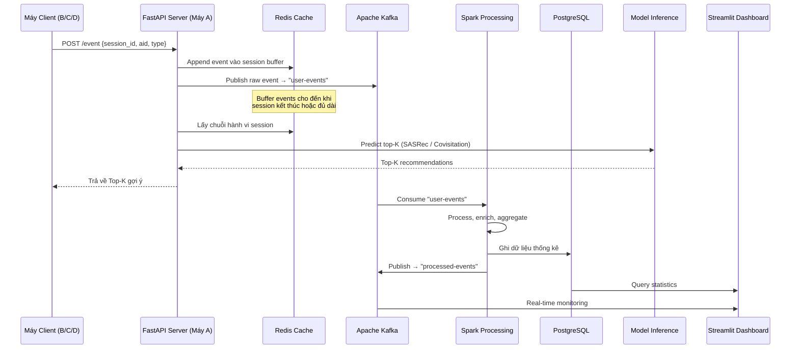
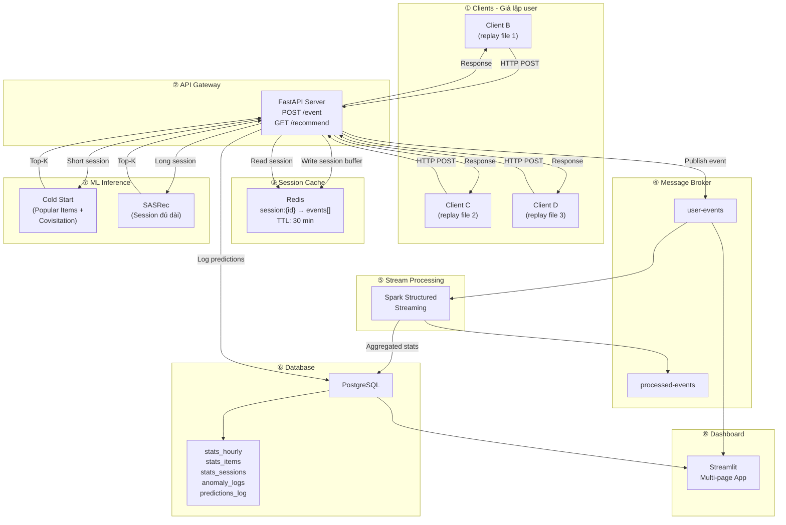
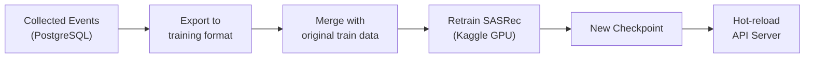

# Pipeline OTTO Recommender System — Bài Tập Lớn Dữ Liệu Lớn (v2)

## 1. Tổng Quan & Bối Cảnh

### Dataset OTTO Recommender System
- **12M+ sessions** thực tế, **~220M events** từ webshop OTTO
- **~1.8M sản phẩm** (article IDs — đã ẩn danh, **không có metadata**)
- **3 loại hành vi**: `clicks`, `carts`, `orders`
- Format: JSONL — `{session, events: [{aid, ts, type}]}`

### Hạn chế quan trọng của dataset
> [!WARNING]
> - Chỉ có ID sản phẩm ẩn danh, **không thể giả lập metadata** vì cùng 1 aid có thể đại diện cho các sản phẩm hoàn toàn khác nhau trong các session khác nhau.
> - Không thể demo kiểu "trang thương mại điện tử" với hình ảnh/tên sản phẩm.
> - → Demo sẽ tập trung vào **luồng dữ liệu ID-based** và **pipeline Big Data**, không phải UI e-commerce.

### Mục tiêu
Xây dựng pipeline **end-to-end giống thật nhất có thể**: Thu thập events → Buffer (Redis) → Kafka → Spark xử lý → Lưu DB (PostgreSQL) → Model inference → Dashboard thống kê + demo gợi ý.

### Hiện trạng dự án
| Component | Trạng thái |
|-----------|-----------|
| Kafka + Kafka UI | ✅ Đã có (docker-compose) |
| Redis | ✅ Đã thêm (docker-compose) |
| PostgreSQL | ✅ Đã thêm (docker-compose) |
| Worker framework (aiokafka) | ✅ Đã có |
| Config system (YAML + env) | ✅ Đã có |
| Spark config | ⚠️ Commented out, sẵn sàng enable |
| SASRec model (Streamlit demo) | ✅ Đã có |
| Covisitation recommender | ✅ Đã có |
| EDA & preprocessing (Spark) | ✅ Đã có |

---

## 2. Kiến Trúc Hệ Thống (Production-like)

### 2.1 Luồng dữ liệu chính



### 2.2 Kiến trúc tổng thể



---

## 3. Luồng Demo Thực Tế (Multi-Machine)

### 3.1 Cách chia dữ liệu
```
Dataset OTTO (train.jsonl + test.jsonl)
├── 70% → Dùng để train SASRec model
├── 15% → Dùng để build covisitation matrix
└── 15% → Chia 3 file cho 3 máy client giả lập
    ├── client_data_B.jsonl
    ├── client_data_C.jsonl
    └── client_data_D.jsonl
```

### 3.2 Luồng demo

```
┌──────────────┐     ┌──────────────┐     ┌──────────────┐
│   Máy B      │     │   Máy C      │     │   Máy D      │
│ (Client)     │     │ (Client)     │     │ (Client)     │
│              │     │              │     │              │
│ Replay       │     │ Replay       │     │ Replay       │
│ sessions     │     │ sessions     │     │ sessions     │
│ từ file B    │     │ từ file C    │     │ từ file D    │
└──────┬───────┘     └──────┬───────┘     └──────┬───────┘
       │ POST /event        │ POST /event        │ POST /event
       └────────────────────┼────────────────────┘
                            ▼
                ┌───────────────────────┐
                │      Máy A (Host)     │
                │                       │
                │  FastAPI ← Redis ←→   │
                │  Kafka → Spark → PG   │
                │  SASRec Model         │
                │  Streamlit Dashboard  │
                └───────────────────────┘
```

### 3.3 API Specification

| Method | Endpoint | Body | Response | Mô tả |
|--------|----------|------|----------|-------|
| POST | `/api/event` | `{session_id, aid, type, ts?}` | `{status, recommendations: [...]}` | Ghi event + trả top-K |
| GET | `/api/recommend/{session_id}` | — | `{clicks: [...], carts: [...], orders: [...]}` | Lấy gợi ý cho session |
| GET | `/api/session/{session_id}` | — | `{events: [...], length, types_count}` | Xem chuỗi hành vi |
| GET | `/api/health` | — | `{status, kafka, redis, pg}` | System health check |

---

## 4. Chi Tiết Từng Module

### Module 1: Client Simulator 🎮

**Mục tiêu**: Giả lập nhiều user gửi events qua HTTP, giống production.

#### Tính năng:
| # | Tính năng | Mô tả |
|---|-----------|-------|
| 1 | **Replay từ file JSONL** | Đọc sessions, gửi từng event qua `POST /api/event` |
| 2 | **Tốc độ điều chỉnh** | Speed multiplier (1x, 5x, 10x, max) |
| 3 | **Concurrent sessions** | Chạy nhiều sessions song song (asyncio) |
| 4 | **Hiển thị kết quả** | In ra terminal: event gửi đi + top-K nhận được |
| 5 | **Chạy trên máy khác** | Chỉ cần IP máy host, không cần cài gì ngoài Python + requests |

#### Files:
- `src/simulator/client.py` — HTTP client, replay logic
- `src/simulator/main.py` — CLI entry point

---

### Module 2: FastAPI Server (API Gateway) 🌐

**Mục tiêu**: Nhận events từ clients, quản lý session qua Redis, trả recommendations.

#### Luồng xử lý khi nhận POST /event:
```
1. Nhận {session_id, aid, type}
2. Append event vào Redis: RPUSH session:{id} {aid, type, ts}
3. Publish event lên Kafka topic "user-events"
4. Đọc session history từ Redis: LRANGE session:{id} 0 -1
5. IF session.length < 3:
     → Cold Start: popular items + covisitation
   ELSE:
     → SASRec inference
6. Log prediction vào PostgreSQL
7. Trả về {recommendations: top_k_items}
```

#### Cold Start Strategy:
| Điều kiện | Chiến lược | Chi tiết |
|-----------|-----------|---------|
| Session = 0 events | **Global Popular** | Top items theo tổng clicks/orders toàn bộ dataset |
| Session = 1-2 events | **Covisitation + Temporal Popular** | Items hay đi cùng aid vừa click + popular theo ngày/tuần |
| Session ≥ 3 events | **SASRec Full Inference** | Đưa full session vào model |

#### Covisitation Scoring (cải tiến):
```python
# Trọng số theo event type
TYPE_WEIGHTS = {"clicks": 1.0, "carts": 3.0, "orders": 6.0}

# Trọng số theo khoảng cách (events gần nhau → trọng số cao hơn)
def distance_weight(pos_a, pos_b, total_events):
    distance = abs(pos_a - pos_b)
    return 1.0 / (1.0 + distance)

# Score = Σ type_weight × distance_weight × frequency
```

#### Files:
- `src/api/main.py` — FastAPI app
- `src/api/routes.py` — API endpoints
- `src/api/session_manager.py` — Redis session CRUD
- `src/api/cold_start.py` — Popular items + covisitation fallback
- `src/api/inference.py` — SASRec + Covisitation routing

---

### Module 3: Spark Processing 🔧

**Mục tiêu**: Consume events từ Kafka, xử lý/enrich, ghi aggregated stats vào PostgreSQL.

#### 3.1 Streaming Job (Spark Structured Streaming)
| # | Task | Mô tả |
|---|------|-------|
| 1 | **Consume from Kafka** | Đọc events từ topic `user-events` |
| 2 | **Event Enrichment** | Thêm: `hour_of_day`, `day_of_week`, `is_weekend` |
| 3 | **Windowed Aggregation** | Mỗi 1 phút: tổng events, unique sessions, top items |
| 4 | **Write to PostgreSQL** | Ghi aggregated stats vào bảng `stats_hourly` |
| 5 | **Anomaly Detection** | Flag sessions bất thường (bot, click fraud) → bảng `anomaly_logs` |

#### 3.2 Batch Job (one-time, trên historical data)
| # | Task | Mô tả |
|---|------|-------|
| 1 | **Build Covisitation Matrix** | Từ train data (đã có) |
| 2 | **Compute Popular Items** | Top items by clicks/carts/orders, daily/weekly/all-time |
| 3 | **EDA Statistics** | Event distributions, session lengths, temporal patterns |
| 4 | **Funnel Analysis** | Click → Cart → Order conversion rates |
| 5 | **All stats → PostgreSQL** | Ghi vào DB để dashboard query |

#### Files:
- `src/streaming/spark_streaming_job.py` — Structured Streaming from Kafka
- `src/streaming/anomaly_detector.py` — Real-time anomaly rules
- `src/batch/compute_stats.py` — Batch statistics → PostgreSQL
- `src/batch/build_popular_items.py` — Popular items tables

---

### Module 4: PostgreSQL Schema 🗄️

**Mục tiêu**: Lưu trữ mọi dữ liệu thống kê, predictions, anomalies cho dashboard query.

#### Schema:
```sql
-- Thống kê theo giờ (từ Spark aggregation)
CREATE TABLE stats_hourly (
    id SERIAL PRIMARY KEY,
    window_start TIMESTAMP NOT NULL,
    window_end TIMESTAMP NOT NULL,
    total_events INT,
    total_clicks INT,
    total_carts INT,
    total_orders INT,
    unique_sessions INT,
    unique_items INT,
    created_at TIMESTAMP DEFAULT NOW()
);

-- Thống kê sản phẩm (từ batch EDA)
CREATE TABLE stats_items (
    aid INT PRIMARY KEY,
    total_clicks INT DEFAULT 0,
    total_carts INT DEFAULT 0,
    total_orders INT DEFAULT 0,
    click_to_cart_rate FLOAT,
    click_to_order_rate FLOAT,
    cart_to_order_rate FLOAT,
    last_updated TIMESTAMP DEFAULT NOW()
);

-- Thống kê sessions (từ batch EDA)
CREATE TABLE stats_sessions (
    session_type VARCHAR(20) PRIMARY KEY, -- browse_only, cart_abandoner, buyer
    count INT,
    avg_length FLOAT,
    avg_duration_sec FLOAT,
    pct_of_total FLOAT
);

-- Log predictions (từ API server)
CREATE TABLE predictions_log (
    id SERIAL PRIMARY KEY,
    session_id BIGINT NOT NULL,
    model_used VARCHAR(20), -- 'sasrec', 'covisitation', 'popular'
    session_length INT,
    predicted_items INT[],
    prediction_type VARCHAR(10), -- 'clicks', 'carts', 'orders'
    latency_ms FLOAT,
    created_at TIMESTAMP DEFAULT NOW()
);

-- Anomaly logs (từ Spark streaming)
CREATE TABLE anomaly_logs (
    id SERIAL PRIMARY KEY,
    session_id BIGINT NOT NULL,
    anomaly_type VARCHAR(30), -- 'bot', 'click_fraud', 'cart_abuse', 'spike'
    details JSONB,
    detected_at TIMESTAMP DEFAULT NOW()
);

-- Sản phẩm phổ biến (pre-computed, cho cold start)
CREATE TABLE popular_items (
    id SERIAL PRIMARY KEY,
    time_scope VARCHAR(20), -- 'all_time', 'weekly', 'daily'
    event_type VARCHAR(10), -- 'clicks', 'carts', 'orders'
    aid INT NOT NULL,
    count INT NOT NULL,
    rank INT NOT NULL,
    computed_at TIMESTAMP DEFAULT NOW()
);

-- Funnel analysis results
CREATE TABLE funnel_stats (
    id SERIAL PRIMARY KEY,
    total_sessions INT,
    sessions_with_clicks INT,
    sessions_with_carts INT,
    sessions_with_orders INT,
    click_to_cart_rate FLOAT,
    cart_to_order_rate FLOAT,
    click_to_order_rate FLOAT,
    computed_at TIMESTAMP DEFAULT NOW()
);
```

#### Files:
- `postgres-init/01_create_tables.sql` — DDL scripts (auto-run by docker-compose)

---

### Module 5: Streamlit Dashboard 📺

**Mục tiêu**: Hiển thị toàn bộ hệ thống qua giao diện web, dữ liệu từ PostgreSQL.

#### Pages:
| # | Page | Nội dung | Data Source |
|---|------|---------|-------------|
| 1 | **📊 Tổng quan EDA** | Event distribution, session length histogram, temporal patterns | PostgreSQL `stats_*` |
| 2 | **🔥 Top Sản Phẩm** | Sản phẩm click nhiều, mua nhiều, tỷ lệ click-to-buy, sản phẩm "ế" | PostgreSQL `stats_items` |
| 3 | **🔄 Funnel Analysis** | Click → Cart → Order conversion, cart abandonment rate | PostgreSQL `funnel_stats` |
| 4 | **🤖 Demo Gợi Ý** | Nhập aid + event_type → chuỗi session cập nhật → top-K predictions | FastAPI `/api/event` |
| 5 | **🚨 Anomaly & Bot** | Danh sách sessions bị flag là bot, click fraud; filter/search | PostgreSQL `anomaly_logs` |
| 6 | **⚡ Real-time Monitor** | Events/phút, active sessions, live feed (auto-refresh) | PostgreSQL `stats_hourly` |
| 7 | **📏 Model Performance** | So sánh SASRec vs Covisitation, latency histogram, cold-start stats | PostgreSQL `predictions_log` |

#### Page 4 (Demo Gợi Ý) — Chi tiết:
```
┌─────────────────────────────────────────────────┐
│  🤖 Demo Hệ Gợi Ý OTTO                        │
│                                                  │
│  Session ID: [auto-generated / nhập tay]        │
│                                                  │
│  Event Type: [clicks ▼]   Aid: [_______] [Gửi]│
│                                                  │
│  ── Chuỗi hành vi hiện tại ──────────────────── │
│  #1  clicks  → aid: 59625                       │
│  #2  clicks  → aid: 1142000                     │
│  #3  carts   → aid: 59625                       │
│                                                  │
│  ── Gợi ý (Model: SASRec) ─────────────────── │
│  Clicks:  [12345, 67890, 11111, ...]            │
│  Carts:   [12345, 99999, 22222, ...]            │
│  Orders:  [12345, 55555, 33333, ...]            │
│                                                  │
│  ── Thống kê phiên ──────────────────────────── │
│  Độ dài session: 3 events                       │
│  Model used: sasrec (latency: 23ms)             │
│  Cold start: No                                  │
└─────────────────────────────────────────────────┘
```

#### Files:
- `streamlit_app.py` — Multi-page app entry (rewrite)
- `src/dashboard/pages/01_eda_overview.py`
- `src/dashboard/pages/02_top_products.py`
- `src/dashboard/pages/03_funnel_analysis.py`
- `src/dashboard/pages/04_recommendation_demo.py`
- `src/dashboard/pages/05_anomaly_detection.py`
- `src/dashboard/pages/06_realtime_monitor.py`
- `src/dashboard/pages/07_model_performance.py`
- `src/dashboard/db.py` — PostgreSQL connection helper

---

### Module 6: Retrain Pipeline (Concept) 🔄

**Mục tiêu**: Sau một khoảng thời gian thu thập dữ liệu mới, retrain model.

> [!NOTE]
> Module này chủ yếu ở mức **thiết kế / khái niệm** cho bài báo cáo. Việc retrain SASRec cần GPU + thời gian dài, nên trong demo chỉ cần giải thích luồng.



---

## 5. Technology Stack (Updated)

| Layer | Technology | Lý do |
|-------|-----------|-------|
| **API Gateway** | **FastAPI** ⭐ NEW | REST API cho multi-client communication |
| **Session Cache** | **Redis** ⭐ NEW | In-memory session buffer, TTL auto-cleanup |
| **Database** | **PostgreSQL** ⭐ NEW | Persistent storage cho thống kê + predictions |
| **Message Broker** | Apache Kafka (đã có) | Event streaming backbone |
| **Stream Processing** | PySpark Structured Streaming | Real-time aggregation từ Kafka → PG |
| **Batch Processing** | PySpark SQL | Batch EDA trên historical data |
| **ML Inference** | PyTorch (SASRec) + Covisitation | Hybrid recommendation |
| **Dashboard** | Streamlit | Multi-page dashboard, query từ PostgreSQL |
| **Containerization** | Docker Compose (đã có) | Kafka + Redis + PG + Kafka UI |

---

## 6. Kế Hoạch Triển Khai (Phases)

### Phase 1: Infrastructure + Data Prep (2 ngày) 🏗️
- [ ] PostgreSQL schema (init SQL scripts)
- [ ] Chia dataset thành train/validate/client files
- [ ] Batch job: compute popular items + funnel stats → PostgreSQL
- [ ] Batch job: EDA statistics → PostgreSQL

### Phase 2: API Server + Session Logic (3 ngày) 🌐
- [ ] FastAPI server với Redis session management
- [ ] Cold-start logic (popular items + covisitation)
- [ ] SASRec inference integration
- [ ] Prediction logging vào PostgreSQL
- [ ] Client simulator (HTTP replay)

### Phase 3: Spark Processing (2-3 ngày) ⚡
- [ ] Spark Structured Streaming: Kafka → aggregate → PostgreSQL
- [ ] Anomaly detection rules → anomaly_logs
- [ ] Windowed stats (events/phút, top items/5min)

### Phase 4: Dashboard (2-3 ngày) 📺
- [ ] Multi-page Streamlit app
- [ ] EDA Overview + Top Products + Funnel
- [ ] Recommendation Demo (interactive)
- [ ] Anomaly Alerts + Real-time Monitor
- [ ] Model Performance comparison

### Phase 5: Integration & Demo (1-2 ngày) 🎬
- [ ] End-to-end test: Clients → API → Kafka → Spark → PG → Dashboard
- [ ] Multi-machine demo setup
- [ ] Performance tuning + documentation

---

## 7. Điểm Mạnh của Kiến Trúc v2

| # | So với v1 | Cải tiến |
|---|-----------|---------|
| 1 | **Giống production thật** | Client → API → Cache → Queue → Processing → DB → Dashboard |
| 2 | **Multi-machine demo** | Nhiều máy client gửi events về 1 host, chứng minh "Big Data" |
| 3 | **Cold Start giải quyết** | Popular items + Covisitation fallback trước khi dùng SASRec |
| 4 | **Persistent storage** | PostgreSQL thay vì chỉ Parquet files, dashboard query nhanh |
| 5 | **Session management** | Redis buffer giống e-commerce thật (TTL, sliding window) |
| 6 | **REST API** | Decoupled architecture, clients chỉ cần HTTP |
| 7 | **Retrain concept** | Dữ liệu mới được thu thập → có thể retrain model |
| 8 | **Dashboard phong phú** | 7 pages covering: EDA, top products, funnel, demo, anomaly, real-time, model perf |

---

## Open Questions

> [!IMPORTANT]
> 1. **SASRec checkpoint**: Đã có `.ckpt` chưa? Nếu chưa, Phase 2 sẽ dùng covisitation-only trước, SASRec bổ sung sau.
>
> 2. **Dữ liệu train**: Có file `train.jsonl` không? Cần cho batch EDA và covisitation matrix.
>
> 3. **Deadline**: Bạn còn bao nhiêu ngày? Plan ~10-14 ngày, có thể cắt giảm.
>
> 4. **Số thành viên nhóm**: Mấy người? Có thể chia module.
>
> 5. **Network setup cho demo**: Các máy client có thể kết nối đến máy host qua LAN/WiFi được không?

---

## Verification Plan

### Automated Tests
- Unit tests: evaluation metrics, cold-start logic, session manager
- Integration: Client → API → Redis → Kafka → Spark → PG (end-to-end)
- Load test: 100 concurrent sessions, measure prediction latency

### Manual Verification
- Demo multi-machine: 3 terminals giả lập 3 clients
- Dashboard: mở Streamlit, kiểm tra tất cả 7 pages
- Cold-start: session mới → xem có popular items không
- Anomaly: inject bot traffic → xem anomaly_logs
