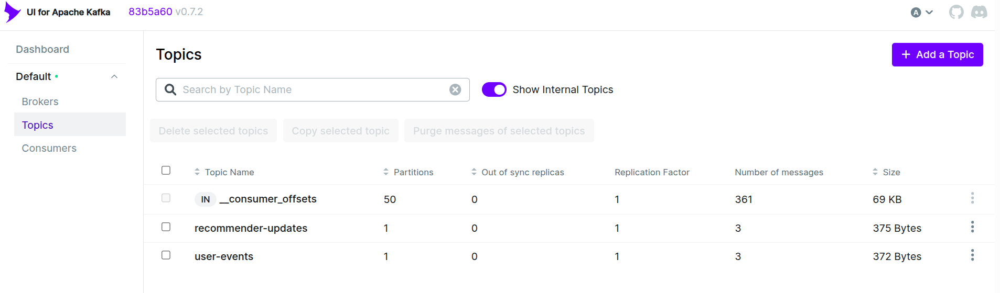

# Setup Guide

## Prerequisites

- JDK 17 (to run Spark).
- Python 3.11+.
- Docker, docker-compose(optional).
- `uv` (https://astral.sh/uv/).
- WSL2 (optional)

## 1. Install required tools

### Ubuntu / WSL / Linux

```bash
sudo apt update
sudo apt install -y openjdk-17-jdk-headless python3-venv curl

# installs `uv`
curl -LsSf https://astral.sh/uv/install.sh | sh          

# (Optional) Docker:

# sudo apt install -y docker.io docker-compose
# sudo usermod -aG docker $USER     # log out/in
```
### Windows (PowerShell or WSL)

1. Install [JDK 17](https://adoptium.net/) or:
   ```powershell
   winget install EclipseAdoptium.Temurin.17.JDK
   ```
2. Install `uv` (optional; you can also use `python -m venv` + `pip`):
   ```powershell
   powershell -ExecutionPolicy ByPass -c "irm https://astral.sh/uv/install.ps1 | iex"
   ```
3. Install Docker Desktop (https://docs.docker.com/desktop/) or use WSL2 with
   `docker` in Linux.

## 2. Create a Python virtual environment & install dependencies

From the repository root:

```bash
uv venv .venv                        
 # or python -m venv .venv
```

Activate the environment:

- **Linux/ WSL**:
  ```bash
  source .venv/bin/activate
  ```

- **Windows (PowerShell)**:
  ```powershell
  .venv\Scripts\Activate.ps1
  ```

- **Windows (cmd.exe)**:
  ```cmd
  .venv\Scripts\activate.bat
  ```

Then install packages:

```bash
uv pip install -r requirements.txt   
# or pip install -r requirements.txt
```

> Always activate the virtual environment before running Python commands.

---

## 3. Configuration file (`.env`)

Create .env file based on the .env.example file

## 4. Docker Compose (Kafka + optional Spark)

The `docker-compose.yml` provided in the repo currently defines a **Kafka
broker** and **Kafka UI**. The Spark master/worker/app services are included but
commented out; you can un-comment them if you want to run Spark in containers
as well.

```yaml
services:
  spark-master:
    image: spark:4.0.1-java21-python3
    container_name: spark-master
    environment:
      - SPARK_MODE=master
      - SPARK_MASTER_HOST=spark-master
    ports:
      - "7077:7077"
      - "8080:8080"
    # Run in foreground to keep container alive and show logs
    command: /opt/spark/bin/spark-class org.apache.spark.deploy.master.Master
    networks:
      - spark-net
    deploy:
      resources:
        limits:
          cpus: '1.0'
          memory: 1g

  spark-worker:
    image: spark:4.0.1-java21-python3
    container_name: spark-worker
    depends_on:
      - spark-master
    environment:
      - SPARK_MODE=worker
      - SPARK_MASTER=spark://spark-master:7077
      - SPARK_WORKER_CORES=2
      - SPARK_WORKER_MEMORY=2g
    volumes:
      - ./:/opt/app:ro
    # Run in foreground to keep container alive
    command: /opt/spark/bin/spark-class org.apache.spark.deploy.worker.Worker spark://spark-master:7077
    networks:
      - spark-net
    deploy:
      resources:
        limits:
          cpus: '1.0'
          memory: 1g

  spark-app:
    build: .
    container_name: spark-app
    depends_on:
      - spark-master
    volumes:
      - ./:/opt/app:ro
    working_dir: /opt/app
    environment:
      - PYSPARK_PYTHON=/usr/bin/python3
      - SPARK_MASTER=spark://spark-master:7077
    networks:
      - spark-net
    deploy:
      resources:
        limits:
          cpus: '1.0'
          memory: 1g

networks:
  spark-net:
    driver: bridge
```

To start Kafka and the UI:

```bash
# start docker if needed (WSL/Linux)
sudo service docker start
docker compose up -d
```

Kafka broker address exposed to the host: `localhost:29092`.

Kafka UI: [http://localhost:8989](http://localhost:8989).

> If you prefer to run Kafka without Docker, download a Kafka distribution and
> start ZooKeeper and the broker manually. Update the `.env` file ports and
> listeners as required. The earlier version of this guide contains a shell
> example.

---

## 6. Running the project.

- If you already have PySpark and JDK 17 installed you can run everything locally; there is no need to use Docker Compose.
- Use Docker Compose only to start Kafka and the Kafka UI (accessible at `localhost:8989`).

## 7. Kafka UI

Once Kafka is up, access the dashboard at: http://localhost:8989



# Appendix

## PySpark helper files
References from this repository: https://github.com/AlexIoannides/pyspark-example-project
