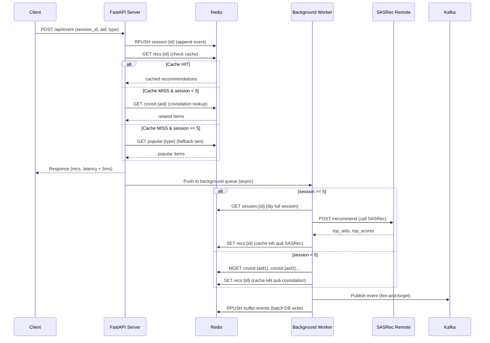

# Implementation Plan: Redis Covisitation Pipeline v2

## Mục tiêu

Cải tiến luồng gợi ý chính (Read-Path) để đạt **latency < 5ms** bằng cách:
1. **Startup**: Load `co_visited_unified.parquet` vào Redis
2. **Read-Path (inline)**: Nhận event → append Redis session → trả recs ngay lập tức
3. **Write-Path (async)**: Gửi Kafka, recompute SASRec khi `session_length >= 5`, lưu cache
4. **Transition Rule**: `session < 5` → covisitation Redis, `session >= 5` → SASRec remote

---

## Tổng quan kiến trúc mới



---

## Proposed Changes

### Component 1: Lifespan — Load Covisitation vào Redis

#### [MODIFY] [main.py](file:///home/sandaria/mining-on-massive-datasets-ptit-project/src/api/main.py)

**Trong hàm `lifespan()`**, sau khi khởi tạo `session_mgr` và trước `yield`:

```python
# === LOAD CO-VISITATION MATRIX VÀO REDIS ===
import pyarrow.parquet as pq

COVISIT_PARQUET_PATH = os.getenv(
    "COVISIT_PARQUET_PATH", 
    str(Path(root_dir) / "datasets" / "co_visited_unified.parquet")
)

logger.info(f"Loading covisitation matrix from {COVISIT_PARQUET_PATH}...")
try:
    table = pq.read_table(COVISIT_PARQUET_PATH)
    df_covisit = table.to_pandas()
    
    r = session_mgr.redis
    pipe = r.pipeline(transaction=False)
    count = 0
    
    for _, row in df_covisit.iterrows():
        aid = row["aid"]
        candidates = row["candidates"]  # list of struct{aid2, wgt}
        # Compact format: [[aid2, wgt], [aid2, wgt], ...]
        # Candidates đã được sort desc by wgt từ Spark
        compact = json.dumps([[int(c["aid2"]), float(c["wgt"])] for c in candidates])
        pipe.set(f"covisit:{aid}", compact)
        count += 1
        
        if count % 5000 == 0:
            pipe.execute()
            pipe = r.pipeline(transaction=False)
    
    pipe.execute()
    logger.info(f"Loaded {count} items into Redis covisitation (covisit:*)")
except Exception as e:
    logger.warning(f"Failed to load covisitation matrix: {e}")
```

> [!IMPORTANT]
> Schema của `co_visited_unified.parquet` là:
> - `aid: long` — ID sản phẩm nguồn
> - `candidates: array<struct<aid2: long, wgt: double>>` — danh sách sản phẩm liên quan đã sort desc theo wgt
> 
> Cần xác nhận cột candidates khi đọc bằng pandas có trả về list of dict hay list of tuple. Nếu dùng PyArrow trực tiếp thì sẽ là list of dict.

---

### Component 2: Helper Functions — Đọc Covisitation từ Redis

#### [MODIFY] [main.py](file:///home/sandaria/mining-on-massive-datasets-ptit-project/src/api/main.py)

Thêm 2 hàm helper mới:

```python
def get_covisitation_from_redis(aid: int, top_k: int = 20) -> List[int]:
    """
    Đọc danh sách sản phẩm liên quan của 1 aid từ Redis.
    Data đã được sort desc by weight khi load.
    """
    raw = session_mgr.redis.get(f"covisit:{aid}")
    if not raw:
        return []
    items = json.loads(raw)  # [[aid2, wgt], [aid2, wgt], ...]
    return [int(item[0]) for item in items[:top_k]]


def covisitation_recommend_from_redis(
    session_aids: List[int], top_k: int = 20
) -> Dict[str, List[int]]:
    """
    Từ danh sách session aids, lấy tất cả related items từ Redis,
    cộng dồn trọng số, và trả về top-K cho mỗi event type.
    """
    from collections import defaultdict
    scores = defaultdict(float)
    
    # MGET để lấy tất cả covisitation chỉ trong 1 RTT
    keys = [f"covisit:{aid}" for aid in session_aids]
    raw_results = session_mgr.redis.mget(keys)
    
    for raw in raw_results:
        if not raw:
            continue
        items = json.loads(raw)
        for aid2, wgt in items:
            scores[int(aid2)] += float(wgt)
    
    # Loại bỏ items đã có trong session
    for aid in session_aids:
        scores.pop(aid, None)
    
    # Sort desc by score, lấy top_k
    sorted_items = sorted(scores.items(), key=lambda x: x[1], reverse=True)
    top_items = [aid2 for aid2, _ in sorted_items[:top_k]]
    
    return {"clicks": top_items, "carts": top_items, "orders": top_items}
```

---

### Component 3: Read-Path — Endpoint `/api/event` (inline, < 5ms)

#### [MODIFY] [main.py](file:///home/sandaria/mining-on-massive-datasets-ptit-project/src/api/main.py) — Hàm `receive_event()`

**Thay thế hoàn toàn logic model selection hiện tại** (line 408-467) bằng:

```python
@app.post("/api/event", response_model=EventResponse)
async def receive_event(event: EventRequest, request: Request):
    start_time = time.time()
    corr_id = getattr(request.state, "correlation_id", "-")
    ts = event.ts or int(time.time() * 1000)

    logger.info(
        f"[{corr_id}] Event received: session={event.session_id} aid={event.aid} type={event.type}"
    )

    # ── B1: Append event vào Redis session ──
    session_length = session_mgr.append_event(
        event.session_id, event.aid, event.type, ts
    )

    # ── B2: Đọc recs từ Redis cache (chỉ đọc, không tính) ──
    cached_recs = session_mgr.get_last_recommendations(event.session_id)

    if cached_recs:
        # Cache HIT — trả recs đã tính sẵn (có thể từ lần gọi SASRec trước)
        model_used = "cached"
        recommendations = cached_recs
    else:
        # Cache MISS — chọn chiến lược theo session_length
        if session_length < 5:
            # Covisitation từ Redis: chỉ tra cứu item vừa tương tác
            model_used = "covisitation_redis"
            recs_list = get_covisitation_from_redis(event.aid, TOP_K)
            if not recs_list:
                # Fallback: popular items từ DB cache
                model_used = "covisitation_fallback_popular"
                recs_list = cold_start._get_popular("clicks", TOP_K)
            recommendations = {
                "clicks": recs_list,
                "carts": recs_list,
                "orders": recs_list,
            }
        else:
            # Session >= 5: trả popular items tạm, đợi SASRec async tính xong
            model_used = "popular_pending_sasrec"
            recommendations = {
                "clicks": cold_start._get_popular("clicks", TOP_K),
                "carts": cold_start._get_popular("carts", TOP_K),
                "orders": cold_start._get_popular("orders", TOP_K),
            }

    # ── B3: Trả response ngay lập tức ──
    latency_ms = (time.time() - start_time) * 1000

    # ── B4: Push vào background queue (non-blocking) ──
    # Chỉ push khi cần recompute
    should_recompute = (
        not cached_recs  # Cache miss
        or session_length >= 5  # Model nặng cần refresh
        or event.type in ["carts", "orders"]  # Signal mạnh
    )
    if should_recompute:
        try:
            background_queue.put_nowait({
                "session_id": event.session_id,
                "session_length": session_length,
                "event_aid": event.aid,
                "event_type": event.type,
                "ts": ts,
                "corr_id": corr_id,
            })
        except asyncio.QueueFull:
            logger.warning(f"[{corr_id}] Background queue full, skipping recompute")

    # ── B5: Kafka publish (fire-and-forget) ──
    if kafka_queue:
        kafka_queue.put_nowait(
            KafkaMessage(
                topic="user-events",
                message={
                    "session_id": event.session_id,
                    "aid": event.aid,
                    "type": event.type,
                    "ts": ts,
                    "model_used": model_used,
                },
                key=str(event.session_id),
            )
        )

    # ── B6: Buffer event/prediction to Redis (batch DB writes) ──
    event_data = json.dumps(
        {"session_id": event.session_id, "aid": event.aid, "type": event.type, "ts": ts}
    )
    session_mgr.redis.rpush(REDIS_EVENT_BUFFER, event_data)
    session_mgr.redis.ltrim(REDIS_EVENT_BUFFER, -MAX_BUFFER_SIZE, -1)
    session_mgr.redis.expire(REDIS_EVENT_BUFFER, BUFFER_TTL_SECONDS)

    pred_data = json.dumps({
        "session_id": event.session_id,
        "model_used": model_used,
        "session_length": session_length,
        "predicted_clicks": recommendations.get("clicks", []),
        "predicted_carts": recommendations.get("carts", []),
        "predicted_orders": recommendations.get("orders", []),
        "latency_ms": latency_ms,
    })
    session_mgr.redis.rpush(REDIS_PREDICTION_BUFFER, pred_data)
    session_mgr.redis.ltrim(REDIS_PREDICTION_BUFFER, -MAX_BUFFER_SIZE, -1)
    session_mgr.redis.expire(REDIS_PREDICTION_BUFFER, BUFFER_TTL_SECONDS)

    # ── B7: Online hit tracking ──
    if event.type in ["carts", "orders"]:
        all_recs = set(
            recommendations.get("clicks", [])
            + recommendations.get("carts", [])
            + recommendations.get("orders", [])
        )
        is_hit = event.aid in all_recs
        session_mgr.redis.rpush(
            "buffer:online_hits",
            json.dumps({
                "session_id": event.session_id,
                "aid": event.aid,
                "event_type": event.type,
                "is_hit": is_hit,
            }),
        )
        session_mgr.redis.ltrim("buffer:online_hits", -MAX_BUFFER_SIZE, -1)
        session_mgr.redis.expire("buffer:online_hits", BUFFER_TTL_SECONDS)

        ground_truth = [event.aid]
        all_recs_list = (
            recommendations.get("clicks", [])
            + recommendations.get("carts", [])
            + recommendations.get("orders", [])
        )
        eval_metrics = {
            "recall@20": recall_at_k(all_recs_list, ground_truth, k=20),
            "ndcg@20": ndcg_at_k(all_recs_list, ground_truth, k=20),
            "mrr@20": mrr_at_k(all_recs_list, ground_truth, k=20),
            "hit_rate": 1.0 if is_hit else 0.0,
        }
        session_mgr.redis.rpush(
            "buffer:online_metrics",
            json.dumps({
                "session_id": event.session_id,
                "model_used": model_used,
                "event_type": event.type,
                "metrics": eval_metrics,
            }),
        )
        session_mgr.redis.ltrim("buffer:online_metrics", -MAX_BUFFER_SIZE, -1)
        session_mgr.redis.expire("buffer:online_metrics", BUFFER_TTL_SECONDS)

    logger.info(f"[{corr_id}] Response: model={model_used} latency={latency_ms:.1f}ms")

    return EventResponse(
        status="ok",
        session_length=session_length,
        model_used=model_used,
        recommendations=recommendations,
        latency_ms=round(latency_ms, 2),
    )
```

---

### Component 4: Write-Path — Background Worker (async recompute)

#### [MODIFY] [main.py](file:///home/sandaria/mining-on-massive-datasets-ptit-project/src/api/main.py)

Thêm background worker mới và background_queue vào lifespan:

```python
# Global queue
background_queue: asyncio.Queue = None  # khởi tạo trong lifespan

async def background_recompute_worker():
    """
    Write-Path async worker:
    - session < 5: tính covisitation từ Redis cho toàn bộ session aids
    - session >= 5: gọi SASRec remote model
    - Lưu kết quả vào Redis cache (recs:{session_id})
    """
    while True:
        try:
            event = await background_queue.get()
            session_id = event["session_id"]
            corr_id = event.get("corr_id", "-")
            
            # Lấy toàn bộ session aids từ Redis
            session_aids = session_mgr.get_session_aids(session_id)
            session_length = len(session_aids)
            
            if session_length == 0:
                continue
            
            if session_length >= 5:
                # === SASRec Deep Learning ===
                model_used = "sasrec_deep_learning"
                try:
                    recs = call_sasrec_with_fallback(
                        session_aids, TOP_K, request_id=corr_id
                    )
                except (pybreaker.CircuitBreakerError, Exception) as e:
                    logger.warning(
                        f"[Worker][{corr_id}] SASRec failed, fallback to covisitation: {e}"
                    )
                    model_used = "sasrec_fallback_covisitation"
                    recs = covisitation_recommend_from_redis(session_aids, TOP_K)
            else:
                # === Covisitation từ Redis (multi-aid) ===
                model_used = "covisitation_redis_multi"
                recs = covisitation_recommend_from_redis(session_aids, TOP_K)
            
            # Lưu kết quả vào Redis cache
            session_mgr.store_recommendations(session_id, recs)
            logger.info(
                f"[Worker][{corr_id}] Recomputed recs for session {session_id} "
                f"(len={session_length}, model={model_used})"
            )
            
        except Exception as e:
            logger.error(f"[Worker] Error: {e}")
```

**Trong `lifespan()`**, thêm khởi tạo queue và worker:

```python
# Trong lifespan(), trước yield:
global background_queue
background_queue = asyncio.Queue(maxsize=1000)
asyncio.create_task(background_recompute_worker())
logger.info("Background recompute worker started")
```

---

### Component 5: Endpoint `/api/recommend/{session_id}` cập nhật

#### [MODIFY] [main.py](file:///home/sandaria/mining-on-massive-datasets-ptit-project/src/api/main.py) — Hàm `get_recommendations()`

Cập nhật transition rule đồng bộ với Read-Path:

```python
@app.get("/api/recommend/{session_id}")
async def get_recommendations(session_id: int, top_k: int = 20):
    session_aids = session_mgr.get_session_aids(session_id)
    session_length = len(session_aids)

    if session_length == 0:
        model_used = "popular"
        recommendations = cold_start.recommend_empty_session(top_k)
    elif session_length < 5:
        model_used = "covisitation_redis"
        recommendations = covisitation_recommend_from_redis(session_aids, top_k)
        if not any(recommendations.values()):
            model_used = "covisitation_fallback_popular"
            recommendations = cold_start.recommend(session_aids, top_k)
    else:
        model_used = "sasrec_deep_learning"
        try:
            recommendations = call_sasrec_with_fallback(session_aids, top_k)
        except Exception:
            model_used = "sasrec_fallback_covisitation"
            recommendations = covisitation_recommend_from_redis(session_aids, top_k)

    return {
        "session_id": session_id,
        "session_length": session_length,
        "model_used": model_used,
        "recommendations": recommendations,
    }
```

---

## Không cần sửa

| File | Lý do |
|------|-------|
| [session_manager.py](file:///home/sandaria/mining-on-massive-datasets-ptit-project/src/api/session_manager.py) | Không thay đổi — các method `append_event`, `get_session_aids`, `store_recommendations`, `get_last_recommendations` đã đáp ứng đủ |
| [client.py](file:///home/sandaria/mining-on-massive-datasets-ptit-project/src/simulator/client.py) | Không thay đổi — client vẫn gửi `POST /api/event` như cũ |
| [sasrec_recommender.py](file:///home/sandaria/mining-on-massive-datasets-ptit-project/src/serving/sasrec_recommender.py) | Không thay đổi — vẫn dùng `recommend_multi_objective()` |
| [remote_sasrec_model.ipynb](file:///home/sandaria/mining-on-massive-datasets-ptit-project/src/serving/remote_sasrec_model.ipynb) | Không thay đổi — remote model server giữ nguyên |

> [!WARNING]
> **Phát hiện API mismatch**: `SASRecRecommender._predict_remote()` gửi `{"session_aids": ..., "top_k": ...}` nhưng remote notebook server nhận `{"click_sequence": ..., "k": ...}`. Nếu chưa sửa ở production thì cần đồng bộ. Tuy nhiên điều này nằm ngoài phạm vi thay đổi lần này.

---

## Tóm tắt Luồng Hoạt Động Mới

```
Client gửi event
    │
    ▼
FastAPI nhận event
    │
    ├─ B1: RPUSH session:{id} vào Redis (append event)
    │
    ├─ B2: GET recs:{id} từ Redis
    │     │
    │     ├─ HIT → trả cached recs (latency ~0.5ms)
    │     │
    │     └─ MISS:
    │           ├─ session < 5 → GET covisit:{aid} từ Redis (latency ~1ms)
    │           └─ session >= 5 → trả popular items tạm (latency ~1ms)
    │
    ├─ B3: Trả Response cho Client (< 5ms)
    │
    ├─ B4: Push event vào Background Queue (non-blocking)
    │
    ├─ B5: Kafka publish (fire-and-forget)
    │
    └─ B6: Buffer event/prediction vào Redis → flush batch vào PostgreSQL
    
Background Worker (async):
    │
    ├─ Lấy event từ queue
    ├─ GET session aids từ Redis
    │
    ├─ session < 5 → MGET covisit:{aid1..aidN} → cộng dồn → lưu recs:{id}
    │
    └─ session >= 5 → Gọi SASRec Remote → lưu recs:{id}
        │
        └─ Fallback → covisitation_recommend_from_redis()
```

---

## Verification Plan

### Automated Tests
1. Khởi động server: `python -m src.api.main`
2. Kiểm tra Redis keys: `redis-cli KEYS covisit:*` — phải có ~1.8M keys
3. Chạy client simulator: `python -m src.simulator.client --sessions 5 --speed 0`
4. Verify:
   - Event 1-4: `model_used` phải là `covisitation_redis`
   - Event 5+: `model_used` phải là `popular_pending_sasrec` (inline) rồi sau đó là `cached` (khi worker đã recompute)
   - Latency inline phải < 5ms

### Manual Verification
- Kiểm tra `redis-cli LLEN session:{id}` tăng dần khi gửi event
- Kiểm tra `redis-cli GET recs:{id}` có dữ liệu sau khi worker chạy xong
- Kiểm tra `redis-cli MEMORY USAGE covisit:*` để ước tính tổng RAM
