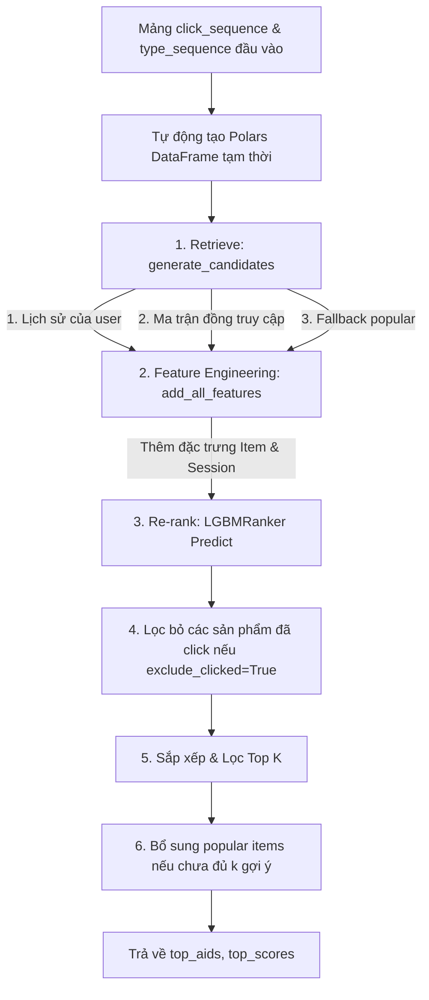

# Note:

Link train: https://www.kaggle.com/code/hngphongkiu/covisited-lgbmranker

# Hướng dẫn Chạy Inference cho Hệ Thống Gợi Ý OTTO (Độc Lập)

Tài liệu này hướng dẫn cách sử dụng file mã nguồn inference độc lập [**`inference.py`**] để tải các tài nguyên (artifacts) đã train và thực hiện dự đoán (inference) gợi ý sản phẩm từ lịch sử tương tác của người dùng dưới dạng Python List.

---

## 1. Cấu trúc các file Artifacts được lưu trữ

Sau khi chạy xong pipeline huấn luyện, toàn bộ tài nguyên phục vụ cho quá trình inference sẽ được lưu tại thư mục `/kaggle/working/artifacts/` (hoặc thư mục tuỳ chọn của bạn) bao gồm các file sau:

| Tên File | Định Dạng | Mô Tả |
| :--- | :--- | :--- |
| `covisit_clicks.parquet` | Parquet | Ma trận đồng truy cập cho Click (Session-based) |
| `covisit_cart_order.parquet` | Parquet | Ma trận đồng truy cập Cart-Order |
| `covisit_buy2buy.parquet` | Parquet | Ma trận đồng truy cập Buy-to-Buy |
| `popular_items.parquet` | Parquet | Danh sách sản phẩm phổ biến nhất (dùng làm fallback) |
| `global_item_feats_all.parquet` | Parquet | Đặc trưng (features) thống kê sản phẩm trên toàn bộ lịch sử |
| `global_item_feats_7d.parquet` | Parquet | Đặc trưng thống kê sản phẩm trong 7 ngày gần nhất |
| `models.pkl` | Pickle (Binary) | Dictionary chứa 3 mô hình `LGBMRanker` đã train cho clicks, carts và orders |
| `feature_names.json` | JSON | Danh sách tên cột đặc trưng tương ứng đầu vào cho mỗi mô hình |

---

## 2. Giới thiệu Hàm `recommend_topk` trong `inference.py`

Hàm `recommend_topk` hỗ trợ nhận chuỗi các sản phẩm đã tương tác kèm theo **loại tương tác** (click, cart, buy/order) và **timestamp**:

```python
def recommend_topk(
    click_sequence: list,
    covisit_clicks: pl.DataFrame,
    covisit_cart_order: pl.DataFrame,
    covisit_buy2buy: pl.DataFrame,
    popular_items: pl.DataFrame,
    global_item_feats_all: pl.DataFrame,
    global_item_feats_7d: pl.DataFrame,
    models: dict,
    feature_names: dict,
    type_sequence: list = None,
    ts_sequence: list = None,
    target_type: str = "clicks",
    k: int = 20,
    exclude_clicked: bool = True
) -> tuple:
    ...
```

---

## 3. Quy trình chạy Inference bằng Code Python

Dưới đây là đoạn mã Python mẫu giúp bạn import các hàm helper từ `inference.py` và gọi dự đoán trực tiếp:

```python
from pathlib import Path
import polars as pl

# Import các hàm từ script inference độc lập của bạn
from inference import (
    load_pipeline_artifacts,
    recommend_topk
)

# 1. Đường dẫn tới thư mục chứa các artifacts đã lưu
ARTIFACTS_DIR = Path("./artifacts") # Cập nhật đường dẫn thực tế của bạn

# 2. Tải toàn bộ tài nguyên và mô hình lên RAM
(
    covisit_clicks,
    covisit_cart_order,
    covisit_buy2buy,
    popular_items,
    global_item_feats_all,
    global_item_feats_7d,
    models,
    feature_names
) = load_pipeline_artifacts(artifacts_dir=ARTIFACTS_DIR)

# 3. Chuỗi các sản phẩm đã tương tác trong session hiện tại (aid gốc)
click_sequence = [1492293, 910862, 1491172, 424964]

# Loại hành động tương ứng: 0: click, 1: cart, 2: order/buy
# Nếu không truyền (để None), hệ thống mặc định toàn bộ chuỗi là click (0)
type_sequence = [0, 0, 1, 2] 

# 4. Dự đoán Top 20 gợi ý clicks (hoặc "carts", "orders")
top_aids, top_scores = recommend_topk(
    click_sequence=click_sequence,
    covisit_clicks=covisit_clicks,
    covisit_cart_order=covisit_cart_order,
    covisit_buy2buy=covisit_buy2buy,
    popular_items=popular_items,
    global_item_feats_all=global_item_feats_all,
    global_item_feats_7d=global_item_feats_7d,
    models=models,
    feature_names=feature_names,
    type_sequence=type_sequence,  # Truyền loại hành động
    target_type="clicks",         # "clicks", "carts", hoặc "orders"
    k=20,
    exclude_clicked=True
)

# 5. In kết quả gợi ý ra màn hình
print(f"Input clicks  : {click_sequence}")
print(f"Input types   : {type_sequence}")
print(f"Top-20 AIDs   : {top_aids}")
print(f"Top-5 Scores  : {[f'{s:.4f}' for s in top_scores[:5]]}")
```

---

## 4. Cơ chế hoạt động nội bộ của `recommend_topk`

Hàm tự động hoá các bước xử lý dữ liệu phức tạp trên RAM để giữ cho mã nguồn gọi của bạn đơn giản nhất có thể:



---

## 5. Các điểm lưu ý tối ưu

- **Khớp đúng loại hành động**: Khi bạn truyền `type_sequence` với đầy đủ các loại tương tác (0 = click, 1 = cart, 2 = buy), các đặc trưng liên quan đến tần suất giỏ hàng và mua hàng của phiên truy cập đó sẽ được tính toán chính xác tuyệt đối, giúp mô hình LGBMRanker đưa ra dự đoán chất lượng hơn.
- **Timestamp (ts_sequence)**: Nếu không truyền, hệ thống sẽ tự động tạo timestamp tăng dần tuyến tính cách nhau 1 giây. Nếu bạn có thông tin thời gian thực, hãy truyền thêm list `ts_sequence` (đơn vị giây) để mô hình tính toán đặc trưng suy giảm thời gian (recency decay) chuẩn nhất.
- **exclude_clicked**: Loại bỏ các sản phẩm đã tương tác trong danh sách `click_sequence` khỏi kết quả gợi ý nếu đặt giá trị này là `True`.
